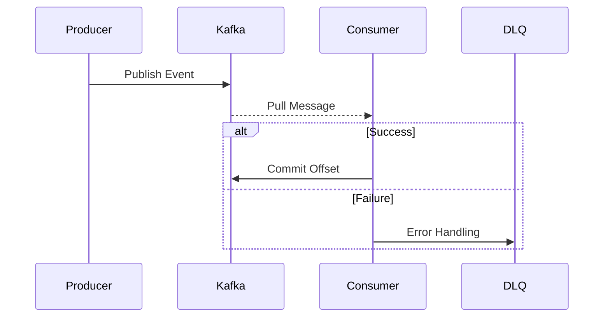

# 🌊 Event Streaming Lab
> "High-Availability Event-Driven Architecture with Apache Kafka."

## 📐 Message Flow

## 📂 Core Patterns
- [**kafka-standard-patterns/**](./kafka-standard-patterns): Idempotent Producer, DLQ Handling.
- [**distributed-transactions/**](./distributed-transactions): Saga Pattern 구현.