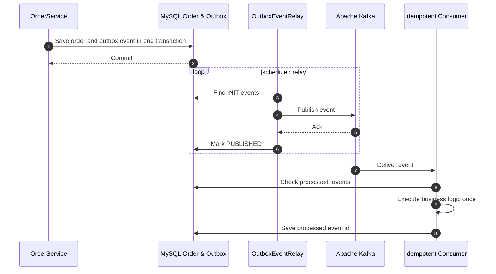

<div align="center">


<h3>🌊 Reliable Event-driven Architecture with Transactional Outbox and Idempotent Consumer</h3>

<p>
  
  
  
  
  
</p>

<p>
  
  
  
</p>

</div>

---

> DB 트랜잭션과 Kafka 메시지 발행 사이의 정합성 문제를 Transactional Outbox와 Idempotent Consumer로 방어하는 이벤트 기반 아키텍처 레퍼런스입니다.  
> 메시지 유실, 데이터 불일치, 중복 처리를 실제 컨테이너 기반 통합 테스트로 검증합니다.

---

## 📌 Problem — 왜 만들었는가

- **메시지 유실**: 주문 저장은 성공했지만 Kafka 발행이 실패하면 다른 서비스가 상태 변경을 알 수 없습니다.
- **데이터 불일치**: Kafka 발행은 성공했지만 DB 트랜잭션이 롤백되면 존재하지 않는 이벤트가 전파됩니다.
- **중복 처리**: at-least-once 전송에서는 동일 메시지가 여러 번 소비될 수 있습니다.
- **브로커 장애 대응**: Kafka가 일시적으로 불안정해도 이벤트 발행을 재시도할 수 있어야 합니다.

Event Streaming Lab은 로컬 트랜잭션으로 outbox를 저장하고, relay가 Kafka로 안전하게 전송하며, consumer가 처리 이력을 기반으로 중복 처리를 방어하는 구조를 제시합니다.

## 🏗️ Architecture — 어떻게 설계했는가



## 📂 Project Structure

```text
event-streaming-lab/
├── .github/workflows/ci.yml                   # ⚙️ Kafka/MySQL 통합 테스트 CI 파이프라인
├── src/main/java/com/hooney/lab/eventstream/
│   ├── application/                           # 🚀 OrderService, Outbox relay, use case 흐름
│   ├── domain/                                # 🧩 Order, OutboxEvent, ProcessedEvent 도메인
│   └── infrastructure/                        # 🔌 Kafka consumer/producer, JPA persistence
├── src/main/resources/                        # ⚙️ Kafka producer/consumer, DB 설정
├── src/test/java/                             # 🧪 Testcontainers 기반 E2E 통합 테스트
├── Dockerfile                                 # 🐳 애플리케이션 컨테이너 이미지 빌드
├── docker-compose.yml                         # 🐳 Kafka, MySQL, App 로컬 실행 환경
```

## 🎯 Key Features & Evidence — 무엇을 증명하는가

### 1. Transactional Outbox Pattern

| Risk | Strategy | Evidence |
| :--- | :--- | :--- |
| DB 저장 후 메시지 유실 | 주문과 outbox를 하나의 로컬 트랜잭션으로 저장 | `OutboxPatternIntegrationTest` |
| Kafka 일시 장애 | INIT 상태 이벤트를 relay가 재조회 후 재시도 | Scheduler integration |
| 발행 상태 추적 불가 | outbox status를 INIT/PUBLISHED로 관리 | Outbox entity |

**Evidence**

- 비즈니스 데이터와 이벤트 페이로드를 하나의 DB 트랜잭션으로 저장하여 원자성을 보장합니다.
- Kafka 발행 성공 ack 이후 outbox 상태를 변경해 발행 완료 여부를 추적합니다.

### 2. Idempotent Consumer

| Feature | Description |
| :--- | :--- |
| **Processed Event Table** | 이미 처리한 이벤트 ID를 저장해 중복 처리 방지 |
| **At-least-once Compatible** | Kafka 재전송 상황에서도 비즈니스 로직은 한 번만 실행 |
| **Consistency First** | 메시지 중복보다 상태 불일치를 더 위험한 문제로 보고 처리 이력을 남김 |

**Evidence**

- 동일 이벤트가 반복 전달되어도 `processed_events` 조회로 중복 실행을 차단합니다.
- Consumer 테스트에서 수신, 이력 확인, 비즈니스 처리, 이력 저장 흐름을 검증합니다.

### 3. Enterprise Reliability Tuning

| Setting | Purpose |
| :--- | :--- |
| **acks=all** | 모든 replica 기록 확인 후 성공 처리 |
| **Idempotent Producer** | Producer retry 과정의 중복 발행 가능성 축소 |
| **Testcontainers** | 실제 Kafka/MySQL에 가까운 격리 통합 테스트 |

**Evidence**

- 단순 mock 테스트가 아니라 Kafka와 MySQL 컨테이너 기반으로 end-to-end 흐름을 검증합니다.
- 장애 가능성이 높은 분산 시스템 경계를 테스트 환경 안으로 끌어옵니다.

## 🚀 Quick Start — 실행 방법

이 프로젝트는 Docker Compose를 통해 애플리케이션과 모든 인프라(Kafka, MySQL)를 한 번에 실행할 수 있도록 구성되어 있습니다.

### 1. 인프라 및 애플리케이션 실행
프로젝트 루트에서 다음 명령어를 입력하세요:
```bash
# 전체 서비스 빌드 및 실행 (백그라운드)
docker-compose up -d --build
```

### 2. 주요 대시보드 및 도구 접속 정보
서비스가 정상적으로 구동되면 브라우저를 통해 다음 도구들에 접속할 수 있습니다:

| 서비스 명 | URL | 용도 |
| :--- | :--- | :--- |
| **Kafka UI** | [http://localhost:8090](http://localhost:8090) | 토픽 모니터링, 메시지 확인, 소비자 그룹 상태 확인 |
| **Swagger UI** | [http://localhost:8080/swagger-ui.html](http://localhost:8080/swagger-ui.html) | API 테스트 및 명세 확인 |
| **MySQL** | `localhost:3306` | Outbox 및 비즈니스 데이터 확인 (ID/PW: root/root) |

### 3. 간단한 API 테스트
Swagger UI에 접속하거나 `curl`을 통해 주문 이벤트를 발생시켜 보세요:
```bash
curl -X POST http://localhost:8080/api/v1/orders \
     -H "Content-Type: application/json" \
     -d '{"productName": "MacBook M5 Max", "amount": 6800000, "customerEmail": "[EMAIL_ADDRESS]"}'
```

### 4. 종료 방법
```bash
docker-compose down
```

## 🧪 Tests — 검증 방법

로컬 환경에 Java 21이 설치되어 있다면 다음 명령어로 테스트를 수행할 수 있습니다. (Testcontainers가 사용되므로 Docker/Podman이 구동 중이어야 합니다.)
```bash
./gradlew test
```

| Test Target | What It Proves |
| :--- | :--- |
| Outbox integration | 주문 저장부터 outbox 적재까지의 로컬 트랜잭션 |
| Relay flow | INIT 이벤트 조회, Kafka 발행, PUBLISHED 상태 변경 |
| Consumer idempotency | 중복 메시지 수신 시 단 한 번만 처리 |
| Testcontainers environment | 실제 Kafka/MySQL 기반 통합 검증 |

## 🧭 Roadmap

- [ ] Redis 기반 Outbox caching
- [ ] Kafka Streams 통합
- [ ] Spring Modulith 마이그레이션
- [ ] 브로커 장애 Chaos Engineering 시나리오
- [ ] Saga pattern 확장

## 🔗 Related Labs

| Related Lab | 연결 이유 |
| :--- | :--- |
| `security-auth-core` | 이벤트 API와 내부 호출의 인증/인가 기준 |
| `infra-master-lab` | Kafka/MySQL 운영 환경과 배포 기준 |
| `database-master-lab` | Outbox, 처리 이력, 트랜잭션 저장소 기준 |
| `realtime-comm-lab` | 이벤트 결과를 실시간 사용자 알림으로 확장 |
| `ai-agent-brain-lab` | 비동기 AI 작업과 이벤트 기반 알림 기준 |

## 📚 Documentation

- [Troubleshooting Guide](./docs/troubleshooting.md)
- [ADR-001: Transactional Outbox Pattern](./docs/decisions/ADR-001-transactional-outbox.md)

## 📄 License

This project is licensed under the [MIT License](./LICENSE).

---

<div align="center">
<b>Built by <a href="https://github.com/hooneyg">Hooney</a> — AI FullStack Developer & Enterprise Solution Architect</b>


</div>
