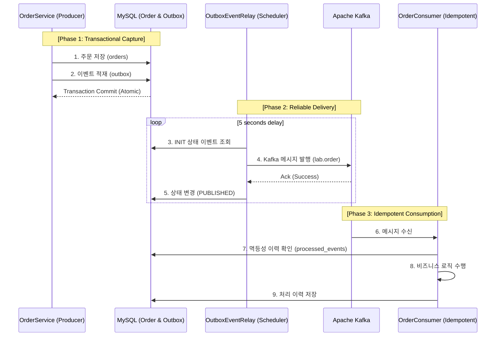

---
## 🌊 Event Streaming Lab (이벤트 스트림 분산 처리 연구소)

> **"분산 시스템에서의 데이터 정합성 파괴를 코드로 막다."**  
> 본 프로젝트는 Apache Kafka를 활용하여 엔터프라이즈 급 이벤트 기반 아키텍처(EDA)를 설계하고, 특히 분산 환경에서 가장 치명적인 **'메시지 유실'**과 **'중복 처리'** 문제를 해결하는 핵심 패턴을 증명합니다.


---

## 📌 Problem — 왜 연구가 필요한가?

분산 시스템에서 비즈니스 로직(DB 업데이트)과 알림/전파(메시지 발행)는 물리적으로 분리된 리소스를 사용합니다. 이때 다음과 같은 **데이터 정합성 결함**이 발생할 수 있습니다:

1.  **메시지 유실(Lost Message)**: 주문 DB 저장은 성공했으나, 네트워크 장애나 브로커 다운으로 카프카 메시지가 발행되지 않는 경우.
2.  **데이터 불일치**: 카프카 전송은 성공했으나, DB 트랜잭션이 최종적으로 롤백되는 경우.
3.  **중복 처리(Duplicate Processing)**: At-least-once 전송 전략으로 인해 동일한 메시지가 소비자에게 두 번 전달되는 경우.

---

## 🏗️ Architecture — 어떻게 설계했는가?

본 랩에서는 **Transactional Outbox Pattern**을 통해 DB와 Kafka 간의 원자성(Atomicity)을 보장합니다.



---

## 📂 Project Structure

### 🏗️ Architecture Layers
| Layer | Path | Description |
| :--- | :--- | :--- |
| **Application** | `application/` | Transactional Outbox 핵심 로직 및 스케줄러(Relay) |
| **Domain** | `domain/` | 비즈니스 엔티티 (Order, Outbox, ProcessedEvent) |
| **Infrastructure** | `infrastructure/` | Kafka Consumer 및 JPA 영속성 레이어 구현체 |

### 🌳 Directory Tree
```text
event-streaming-lab/
├── 🛡️ .github/workflows/ci.yml        # CI/CD 파이프라인 (GitHub Actions)
├── 📦 src/main/java/com/hooney/lab/
│   └── eventstream/
│       ├── 🛠️ application/           # 서비스 및 중계기(Relay) 구현
│       ├── 🌐 domain/                # 도메인 모델 및 아웃박스 상태 관리
│       └── 🔌 infrastructure/        # 메시징(Kafka) 및 persistence 레이어
├── ⚙️ src/main/resources/            # Kafka 튜닝 및 DB 커넥션 설정
├── 🧪 src/test/java/                # Testcontainers 기반 통합 테스트
├── 🐳 Dockerfile                     # 멀티 스테이지 빌드 최적화 설정
└── 🛠️ docker-compose.yml             # Kafka, MySQL 컨테이너 인프라 구성
```

---

## ⚡ Key Features — 무엇을 증명하는가?

### 1. Transactional Outbox Pattern (발행 보장)
- **Local Transactional Consistency**: JPA를 활용하여 비즈니스 데이터와 메시지 페이로드를 하나의 로컬 트랜잭션으로 묶어 저장합니다.
- **At-least-once Delivery**: 스케줄러 기반의 Relay가 전송 성공 확인 후 상태를 업데이트하여, 브로커가 일시 중단되어도 이벤트 발행을 보장합니다.

### 2. Idempotent Consumer (중복 방어)
- **Duplicate Detection**: 수신한 메시지의 고유 식별자를 `processed_events` 테이블에서 조회하여 이미 처리된 과업인지 검증합니다.
- **Consistency**: 재시도로 인해 동일 메시지가 수만 번 들어와도 시스템 상태는 단 한 번만 변경됨을 보장합니다.

### 3. Enterprise Reliability Tuning
- **Producer Acks (all)**: 카프카의 모든 복제본이 메시지를 기록했음을 확인하는 설정을 통해 신뢰성을 극대화했습니다.
- **Idempotent Producer**: 프로듀서 레벨의 멱등성 설정을 통해 카프카 자체의 중복 발행 가능성도 차단했습니다.

---

## 🚀 Quick Start — 어떻게 실행하는가?

본 랩은 **Docker Compose**를 통해 즉시 인프라를 가동할 수 있습니다.

```bash
# 1. 인프라 가동 (Kafka, MySQL)
docker-compose up -d

# 2. 애플리케이션 빌드 및 실행
./gradlew bootRun
```

---

## 🧪 Tests — 어떻게 검증했는가?

**Testcontainers**를 활용하여 격리된 실제 컨테이너 환경에서 전체 사이클을 검증합니다.

```bash
# 통합 테스트 실행
./gradlew test
```

- **`OutboxPatternIntegrationTest`**: 주문 생성 -> 아웃박스 적재 -> 리레이 전송 -> 소비자 수신 및 멱등성 기록까지의 전 과정을 자동화된 테스트로 입증합니다.

---

## 📄 License
This project is licensed under the [MIT License](./LICENSE).

---

<div align="center">
<b>Built with ❤️ by <a href="https://github.com/hooneyg">Hooney</a> — AI FullStack Developer & Enterprise Solution Architect</b>


</div>
