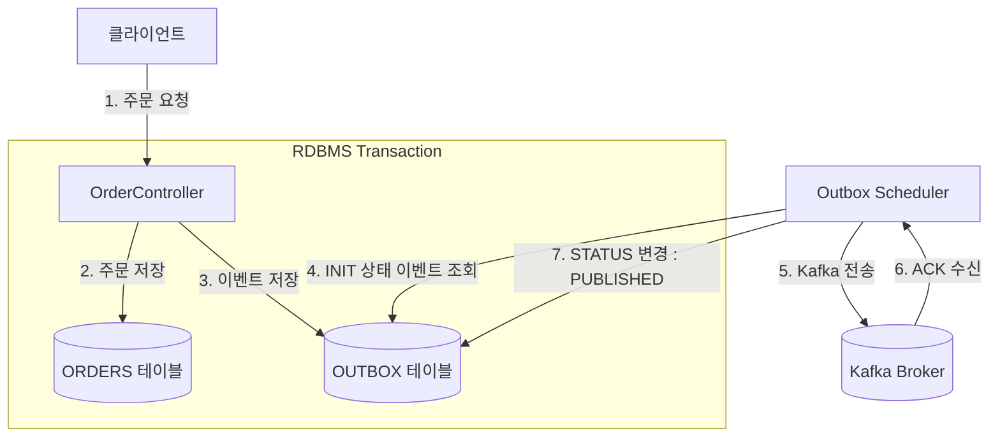

# 📨 Event Streaming Lab 장애 시나리오 및 검증 가이드

이 문서는 `event-streaming-lab` 프로젝트의 핵심 아키텍처인 **트랜잭셔널 아웃박스 패턴(Transactional Outbox Pattern)**과 **장애 회복 탄력성(Resilience)** 메커니즘인 **재시도(Retry)**, **데드 레터 큐(Dead Letter Queue - DLQ)**, **멱등성(Idempotency)**의 동작 원리 및 검증 시나리오를 설명합니다.

---

## 🏗️ 핵심 아키텍처 흐름 (Core Architecture Flow)

분산 시스템(Distributed System) 환경에서 데이터베이스 저장과 카프카(Kafka) 이벤트 발행을 단일 트랜잭션으로 묶을 수 없을 때, 메시지 누락이나 중복 발행을 방지하기 위해 **트랜잭셔널 아웃박스 패턴(Transactional Outbox Pattern)**을 적용합니다.



---

## 🧪 장애 극복 및 신뢰성 검증 시나리오

통합 테스트 코드([OutboxPatternIntegrationTest.java](file:///d:/works/20260513/event-streaming-lab/src/test/java/com/hooney/lab/eventstream/OutboxPatternIntegrationTest.java))에 구현되어 신뢰성을 보증하는 4가지 장애 대응 흐름입니다.

### 시나리오 1: 중복 메시지 유입 및 멱등성 보장 (Idempotency)
- **장애 요인:** 네트워크 불안정으로 인해 프로듀서(Producer)가 카프카로부터 ACK를 받지 못해 동일한 이벤트를 재전송하여 컨슈머(Consumer)에 중복 유입되는 현상.
- **검증 방법:**
  1. 동일한 `eventId`를 가진 중복 주문 이벤트를 카프카 토픽으로 2회 연속 발행합니다.
  2. 컨슈머 단에서 수신 처리 시, 이미 처리된 `eventId` 인지 식별 테이블(`processed_event`)을 검사합니다.
  3. 비즈니스 로직(예: 재고 차감 등) 및 최종 DB 반영 결과가 중복 누적되지 않고 최초 1회만 안전하게 인입되었음을 증명합니다.

### 시나리오 2: 아웃박스 발행 보장 (At-least-once Delivery)
- **장애 요인:** 데이터베이스 저장은 성공했으나 카프카 브로커 장애 또는 네트워크 단절로 인해 메시지 발행 단계에서 예외가 발생한 상황.
- **검증 방법:**
  1. 주문 저장 요청 시 카프카 프로듀서에 인위적으로 `RuntimeException`을 발생시키도록 모킹(Mocking)합니다.
  2. RDBMS 트랜잭션의 특성상 주문 데이터와 아웃박스 이벤트는 DB에 무사히 저장(INIT 상태)되지만, 카프카 발행 실패로 인해 아웃박스 상태가 `PUBLISHED`로 변경되지 않고 `INIT` 상태로 롤백 유지되는지 확인합니다.
  3. 이후 재구동된 스케줄러가 `INIT` 상태인 잔여 이벤트를 재수집하여 카프카로 안전하게 재발행(Re-publish)함을 입증합니다.

### 시나리오 3: DLQ 라우팅 및 재시도 소진 (Retry Exhaustion & DLQ)
- **장애 요인:** 포맷이 깨졌거나 역직렬화(Deserialization)가 불가능한 유해 메시지(Poison Pill)가 토픽에 유입되어 지속적으로 에러를 유발하는 상황.
- **검증 방법:**
  1. 역직렬화 에러를 유발하는 깨진 페이로드 데이터를 카프카 토픽에 주입합니다.
  2. 컨슈머에 정의된 백오프 정책(BackOff Policy)에 의해 최대 3회까지 1초 간격으로 재시도(Retry)가 수행되는지 관찰합니다.
  3. 3회 재시도 후에도 복구되지 않을 시, 해당 메시지를 일반 대기열에서 격리하여 별도의 데드 레터 토픽(`lab.order.DLQ`)으로 안전하게 우회 라우팅하는지 검증합니다.

### 시나리오 4: 컨슈머 부분 장애 복구 및 정상 흐름 유지 (Fault Isolation)
- **장애 요인:** 특정 메시지 처리 과정에서 일시적 예외가 발생했을 때 전체 컨슈머 루프가 멈추거나 그 뒤에 들어오는 정상 메시지 처리까지 가로막는 병목 현상.
- **검증 방법:**
  1. 첫 번째 메시지에 오류를 유도하여 에러 및 DLQ 처리를 수행하게 만듭니다.
  2. 즉시 연이어 두 번째 정상 주문 이벤트를 송신합니다.
  3. 첫 번째 메시지의 에러 여부와 무관하게, 두 번째 메시지는 정상적으로 컨슈머 루프를 통과하여 최종 DB 및 비즈니스 완료 처리되는지 확인하여 시스템 격리성(Isolation)을 실증합니다.

---

## 🛠️ 검증 테스트 구동 명령

모든 시나리오는 스프링 부트 및 테스트컨테이너(Testcontainers) 기반의 통합 테스트를 통해 격리된 환경에서 자동 실행 및 검증이 가능합니다.

```bash
# event-streaming-lab 디렉토리로 이동 후 통합 테스트 실행
./gradlew test --tests "com.hooney.lab.eventstream.OutboxPatternIntegrationTest"
```
